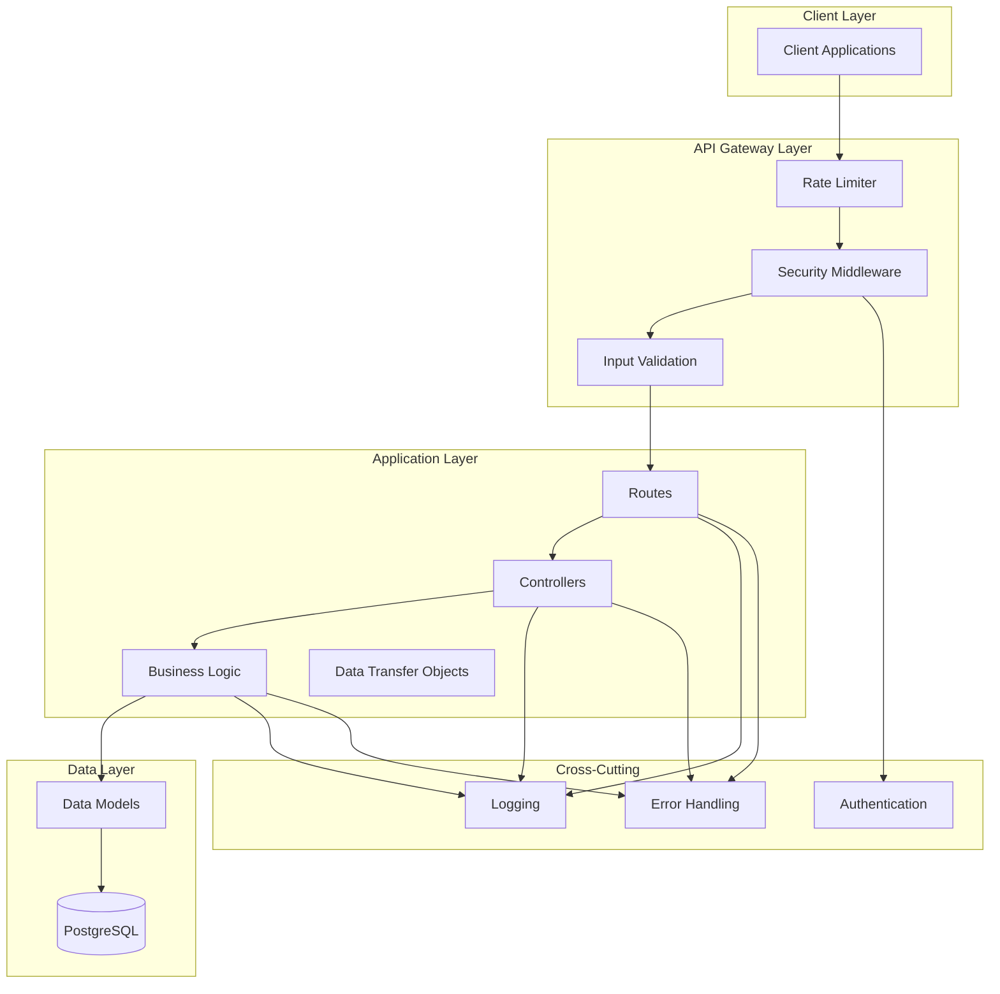
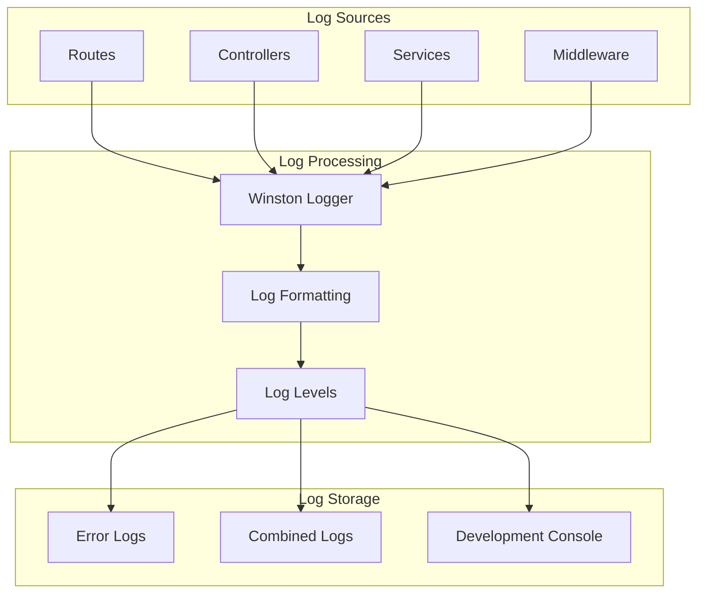
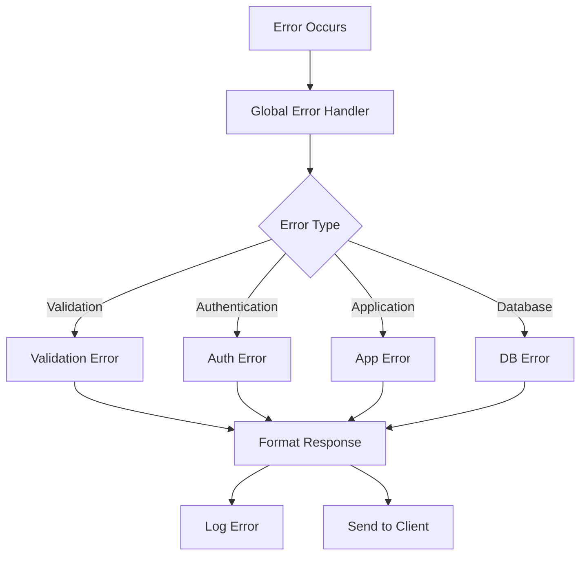
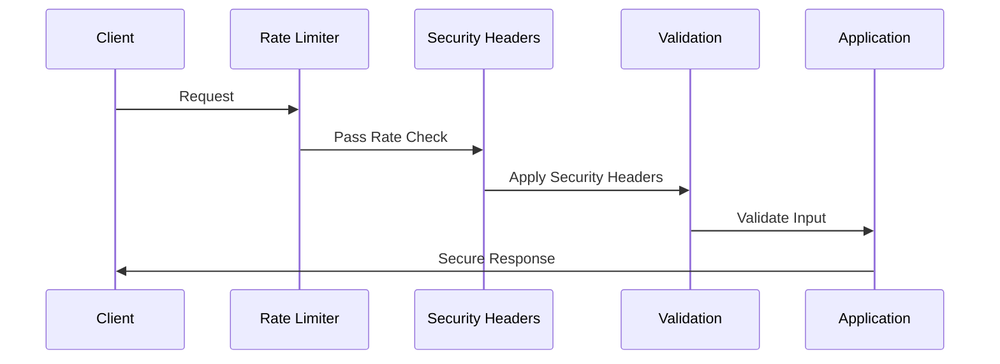
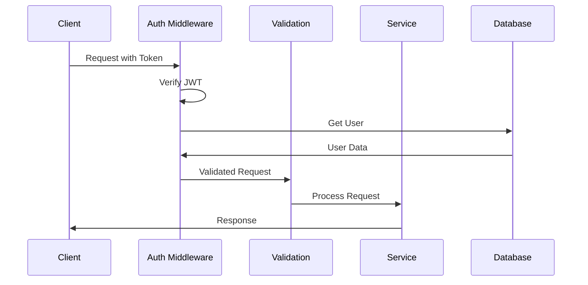
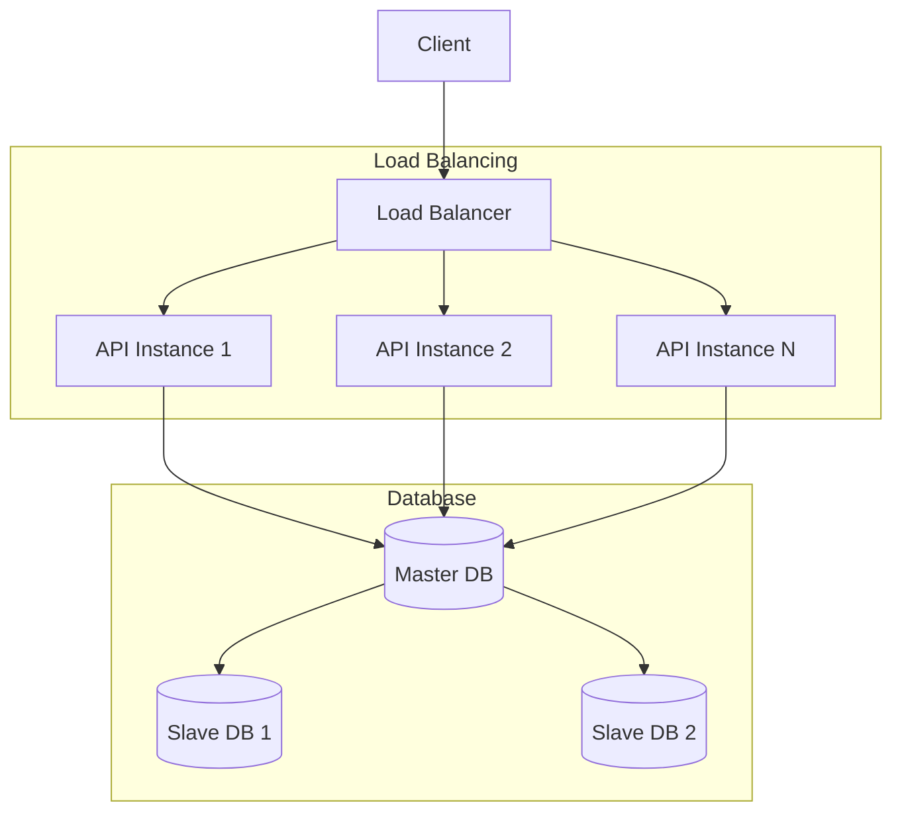
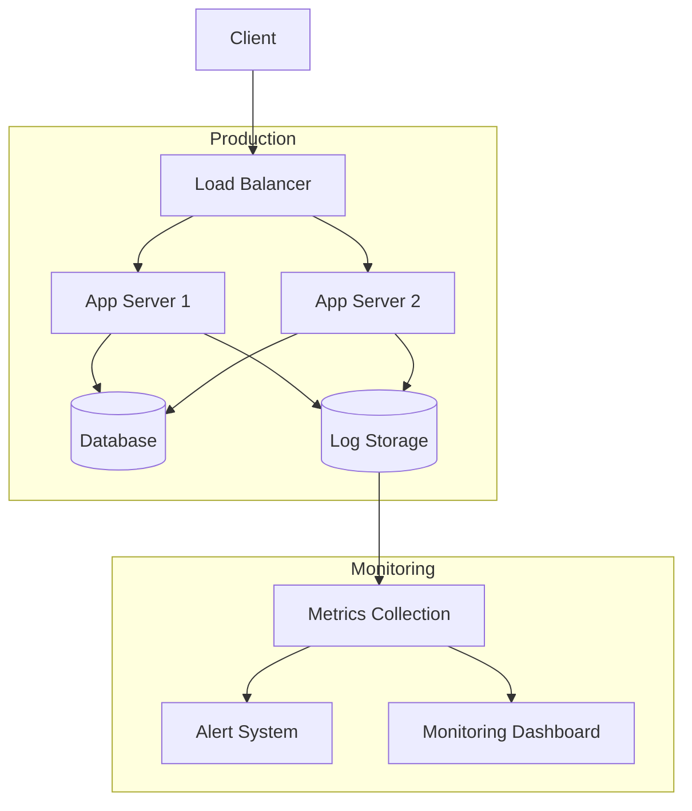

# Technical Architecture Document

## System Architecture



## Component Details

### 1. API Gateway Layer

#### Rate Limiter
- Implements token bucket algorithm
- Different limits for auth and API routes
- Prevents brute force attacks
- Configuration:
  ```typescript
  windowMs: 15 * 60 * 1000, // 15 minutes
  max: 5, // 5 requests for auth routes
  max: 100, // 100 requests for API routes
  ```

#### Security Middleware
- Helmet configuration for HTTP headers
- CORS policy implementation
- XSS protection
- SQL injection prevention
- Request size limits

### 2. Application Layer

#### Routes
- Feature-based routing
- Middleware composition
- Route-specific rate limiting
- Authentication checks

#### Controllers
- Request handling
- Response formatting
- Error delegation
- Service coordination

#### Services
- Business logic implementation
- Database operations
- External service integration
- Error handling

### 3. Data Layer

#### Models
- Database schema definitions
- Data validation
- Relationship management
- Type definitions

#### Database
- PostgreSQL with Knex
- Migration support
- Connection pooling
- Transaction support

### 4. Cross-Cutting Concerns

#### Logging System


#### Error Handling System


## Security Implementation

### 1. Request Flow Security


### 2. Authentication Flow


## Performance Considerations

1. **Database Optimization**
   - Connection pooling
   - Prepared statements
   - Index optimization
   - Query optimization

2. **Caching Strategy**
   - Response caching
   - Database query caching
   - Rate limit caching

3. **Error Recovery**
   - Graceful shutdown
   - Connection retry
   - Error logging
   - Monitoring

## Scalability



## Monitoring and Logging

1. **Log Levels**
   - ERROR: Application errors
   - WARN: Warning conditions
   - INFO: General information
   - DEBUG: Detailed information

2. **Log Categories**
   - Access logs
   - Error logs
   - Application logs
   - Security logs

3. **Metrics**
   - Request duration
   - Error rates
   - Database performance
   - Memory usage

## Deployment Architecture

