# Debugging Guide

## Authentication Service Debugging

### 1. Enable Debug Mode
```bash
# Enable all debugging
DEBUG=app:* npm run dev

# Enable only auth debugging
DEBUG=app:auth npm run dev

# Enable auth and database debugging
DEBUG=app:auth,app:db npm run dev
```

### 2. Signup Process Debug Flow

```mermaid
sequenceDiagram
    participant C as Client
    participant A as AuthService
    participant D as Database
    participant L as Logger

    C->>A: Signup Request
    Note over A: 🚀 Start Timer
    A->>D: Check Existing User
    Note over A: 🔍 Log Query
    D->>A: User Result
    
    alt User Exists
        A->>L: ⚠️ Log Duplicate
        A->>C: Return Error
    else User Doesn't Exist
        Note over A: 🔒 Hash Password
        A->>D: Create User
        Note over A: 👤 Log Creation
        D->>A: User Created
        Note over A: 🎫 Generate Token
        A->>L: ✅ Log Success
        A->>C: Return User & Token
    end
    Note over A: ⏱️ End Timer
```


### 3. Login Process Debug Flow

```mermaid
sequenceDiagram
    participant C as Client
    participant A as AuthService
    participant D as Database
    participant L as Logger

    C->>A: Login Request
    Note over A: 🚀 Start Timer
    A->>D: Find User
    Note over A: 🔍 Log Query
    
    alt User Not Found
        A->>L: ⚠️ Log Invalid
        A->>C: Return Error
    else User Found
        Note over A: 🔒 Verify Password
        alt Password Invalid
            A->>L: ⚠️ Log Invalid
            A->>C: Return Error
        else Password Valid
            Note over A: 🎫 Generate Token
            A->>L: ✅ Log Success
            A->>C: Return User & Token
        end
    end
    Note over A: ⏱️ End Timer
```


### 4. Debug Output Examples

#### Successful Signup:
```log
app:auth 🚀 Starting signup process for email: user@example.com
app:auth 🔍 Checking for existing user...
app:db 🔍 SQL Query: select * from "users" where "email" = $1 limit 1
app:auth 🔒 Hashing password...
app:auth ✅ Password hashed successfully
app:auth 👤 Creating new user...
app:db 🔍 SQL Query: insert into "users" ("email", "password", "name") values ($1, $2, $3)
app:auth ✅ User created successfully with ID: 123
app:auth 🎫 Generating authentication token...
app:auth ✅ Token generated successfully
app:auth ✨ Signup process completed in 235.67ms
```

#### Failed Login:
```log
app:auth 🚀 Starting login process for email: user@example.com
app:auth 🔍 Finding user...
app:auth 🔒 Verifying password...
app:auth ❌ Login failed after 45.23ms
```

### 5. Performance Monitoring

Each operation is timed:
- 🚀 Operation start
- ⏱️ Duration tracking
- ✨ Completion time
- ❌ Failure timing

### 6. Query Debugging

Database queries are logged with:
- Full SQL statement
- Parameter values (passwords hidden)
- Query timing

### 7. Error Handling

Errors are logged with:
- ❌ Error indicator
- Operation duration
- Error details
- Stack trace (in development)

### 8. Debug Categories

1. **Authentication (`app:auth`)**
   - User signup/login attempts
   - Password operations
   - Token generation

2. **Database (`app:db`)**
   - SQL queries
   - Query parameters
   - Database operations

3. **HTTP (`app:http`)**
   - Request/response
   - Headers
   - Body content

4. **Errors (`app:error`)**
   - Validation errors
   - Authentication failures
   - System errors

### 9. Testing Debug Output

Test signup:
```bash
curl -X POST http://localhost:3000/api/auth/signup \
-H "Content-Type: application/json" \
-d '{
    "name": "Test User",
    "email": "test@example.com",
    "password": "TestPass123!"
}'
```

Test login:
```bash
curl -X POST http://localhost:3000/api/auth/login \
-H "Content-Type: application/json" \
-d '{
    "email": "test@example.com",
    "password": "TestPass123!"
}'
```

### 10. Security Notes

- Passwords are never logged
- User data is sanitized in logs
- Query parameters are masked for sensitive data
- Token values are truncated in logs 