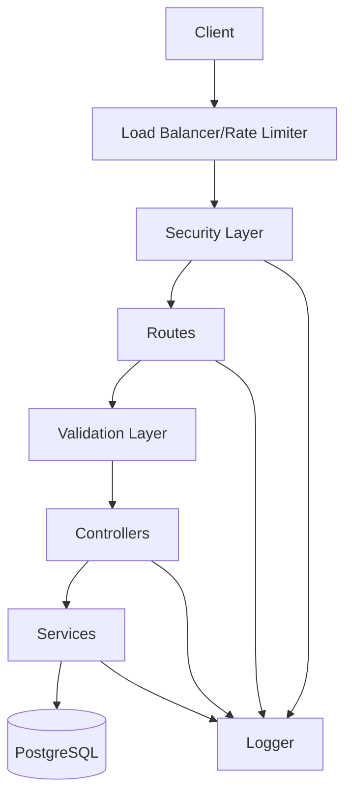
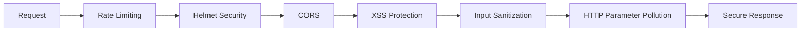
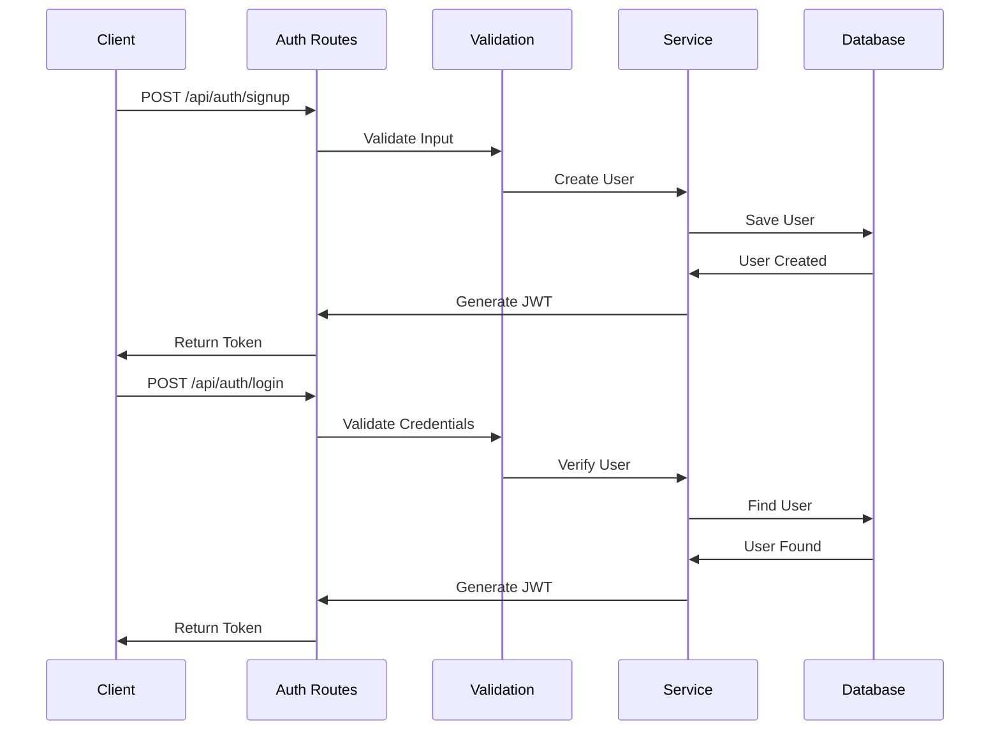
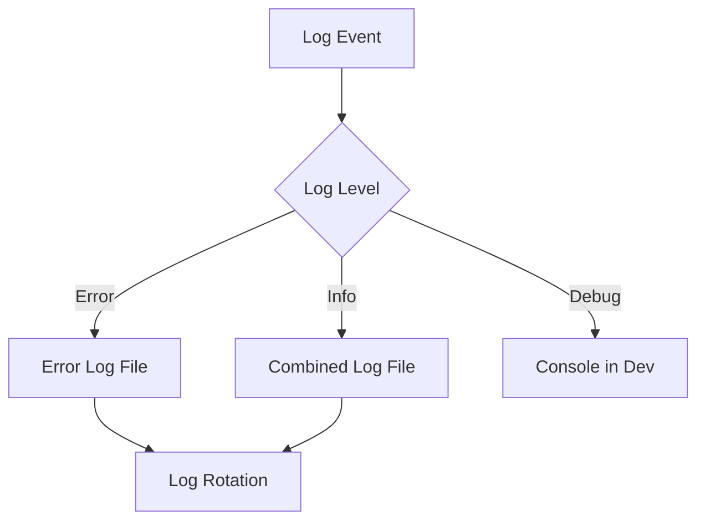

# Backend Arc - Production Grade Node.js Application

## Architecture Overview



## Security Features



## Directory Structure

```
src/
├── config/         # Configuration files
├── controllers/    # Request handlers
├── middleware/     # Custom middleware
├── models/         # Database models
├── routes/         # API routes
├── services/      # Business logic
├── utils/         # Utility functions
├── types/         # TypeScript types
├── app.ts         # Express application
└── server.ts      # Server entry point
```

## Key Features

1. **Security Measures**
   - Rate limiting (Auth & API routes)
   - XSS protection
   - SQL injection prevention
   - Parameter pollution prevention
   - CORS configuration
   - Helmet security headers
   - Request size limits

2. **Input Validation**
   ```mermaid
   graph LR
       Input[Request Body] --> DTO[DTO Validation]
       DTO --> Sanitize[Sanitization]
       Sanitize --> Transform[Transformation]
       Transform --> Valid{Valid?}
       Valid -->|Yes| Next[Next Middleware]
       Valid -->|No| Error[Error Response]
   ```

3. **Error Handling**
   ```mermaid
   graph TD
       Error[Error Occurs] --> Type{Error Type}
       Type -->|Validation| ValidationErr[Validation Error]
       Type -->|Auth| AuthErr[Auth Error]
       Type -->|Not Found| NotFoundErr[Not Found Error]
       Type -->|Other| AppErr[Application Error]
       ValidationErr --> Format[Format Response]
       AuthErr --> Format
       NotFoundErr --> Format
       AppErr --> Format
       Format --> Client[Send to Client]
   ```

## Authentication Flow



## Logging System



## Benefits

1. **Security**
   - Protected against common web vulnerabilities
   - Rate limiting prevents abuse
   - Input validation prevents malicious data
   - Secure headers protect against various attacks

2. **Maintainability**
   - Clear separation of concerns
   - Modular architecture
   - Type safety with TypeScript
   - Consistent error handling

3. **Scalability**
   - Efficient request processing
   - Database connection pooling
   - Rate limiting per route type
   - Log rotation for long-term running

4. **Developer Experience**
   - Clear project structure
   - Strong typing support
   - Comprehensive error messages
   - Easy to add new features

## API Documentation

### Auth Endpoints

#### POST /api/auth/signup
```json
{
  "email": "user@example.com",
  "password": "StrongP@ss123",
  "name": "John Doe"
}
```

Response:
```json
{
  "success": true,
  "data": {
    "id": 1,
    "email": "user@example.com",
    "name": "John Doe",
    "token": "jwt_token"
  },
  "timestamp": "2024-03-20T15:36:33.000Z"
}
```

#### POST /api/auth/login
```json
{
  "email": "user@example.com",
  "password": "StrongP@ss123"
}
```

Response:
```json
{
  "success": true,
  "data": {
    "id": 1,
    "email": "user@example.com",
    "name": "John Doe",
    "token": "jwt_token"
  },
  "timestamp": "2024-03-20T15:36:33.000Z"
}
```

## Environment Configuration

Required environment variables:
```env
# Server Configuration
PORT=3000
NODE_ENV=development

# Database Configuration
DB_HOST=localhost
DB_PORT=5432
DB_NAME=your_database
DB_USER=your_user
DB_PASSWORD=your_password

# JWT Configuration
JWT_SECRET=your_jwt_secret
JWT_EXPIRES_IN=24h

# Rate Limiting
RATE_LIMIT_WINDOW_MS=900000
RATE_LIMIT_MAX_REQUESTS=100
```

## Getting Started

1. Clone the repository
2. Install dependencies:
   ```bash
   npm install
   ```
3. Set up environment variables
4. Run migrations:
   ```bash
   npm run migrate
   ```
5. Start development server:
   ```bash
   npm run dev
   ```

## Best Practices Implemented

1. **Code Organization**
   - Feature-based directory structure
   - Clear separation of concerns
   - Middleware composition
   - Type-safe implementations

2. **Security**
   - Input validation
   - Data sanitization
   - Rate limiting
   - Security headers
   - CORS configuration

3. **Error Handling**
   - Custom error classes
   - Global error handling
   - Validation errors
   - Standardized responses

4. **Logging**
   - Multiple log levels
   - File rotation
   - Development console logs
   - Error tracking

5. **Performance**
   - Request size limits
   - Database connection pooling
   - Rate limiting
   - Efficient validation 