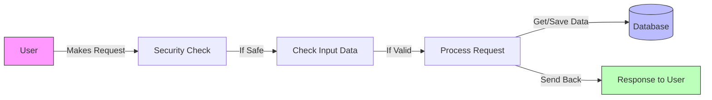
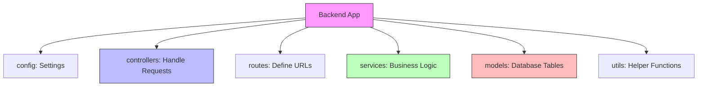
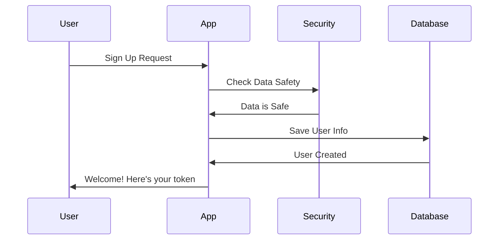
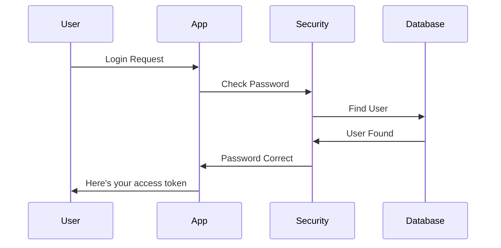
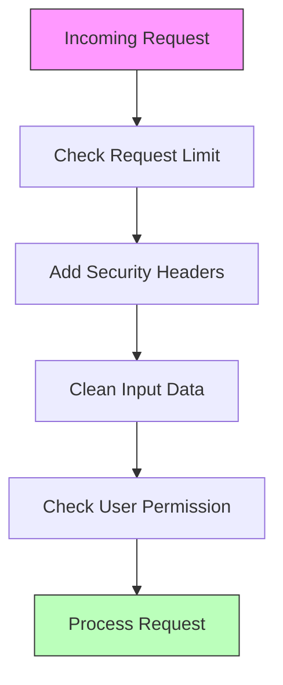
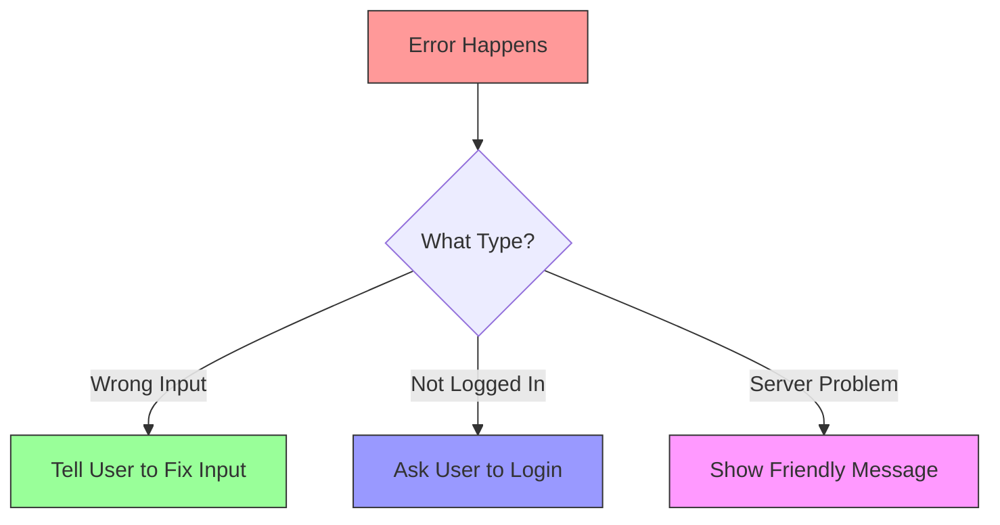

# Simple Overview of Our Backend Application

## 1. Basic Request Flow


## 2. Project Folder Structure Explained


## 3. Sign Up Process


## 4. Login Process


## 5. Security Features


## 6. Error Handling


## Key Points in Simple Terms:

1. **Security First**
   - Checks every request for safety
   - Protects against bad requests
   - Keeps user data safe

2. **Data Handling**
   - Validates all input data
   - Stores data safely in database
   - Sends back clean responses

3. **User Management**
   - Handles sign up and login
   - Keeps track of user sessions
   - Protects user information

4. **Error Management**
   - Catches all problems
   - Shows helpful error messages
   - Keeps app running smoothly

## How to Run the App

1. Start the app:
   ```bash
   npm run dev
   ```

2. The app will:
   - Start on port 3000
   - Connect to database
   - Be ready for requests

3. Available Routes:
   - Sign up: POST /api/auth/signup
   - Login: POST /api/auth/login
   - Health check: GET /health 